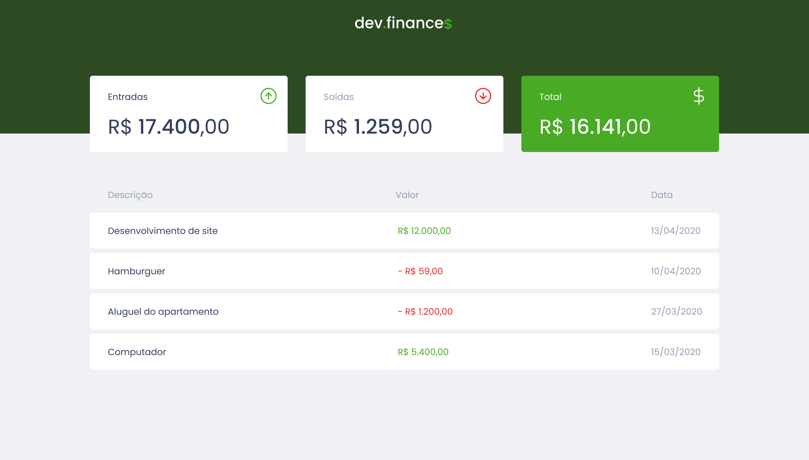
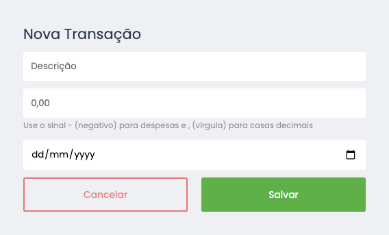

# Maratona Discover
 
<h1> Projeto realizado por <a href="https://github.com/maykbrito">@maykbrito</a></h1>
<h3><a href="https://mdiscover.netlify.app/">Visite o site</a></h3>

  
Aplicação oficial

  
  
Aplicação com mudanças feito por
 [Tiago Oliveira](https://github.com/tosantos1)
  

<!-- ************************************* Baadges ********************************************* -->

  

 

<!-- ************************************* Título ********************************************* -->

<h1> 🚀 Rocketseat - Maratona Discover</h1>

<!-- ************************************* Sobre o projeto ********************************************* -->

<h2>🔥 Sobre o Projeto</h2>

 Nessa edição, eu aprendi construir uma aplicação financeira onde pratiquei habilidades com ferramentas como JavaScript, CSS, HTML, e durante o desenvolvimento aprendi as melhores práticas sobre as linguagens, além de conceitos importantes que contribuiu para construir uma base sólida em programação.

---

<h3>📚 Linguagens / Frameworks / Bibliotecas</h3>

* HTML
* CSS 
* JavaScript
* [Google Fonts](https://fonts.google.com/) - Fontes para o projeto.

<h3>🧰 Ferramentas</h3>

* [Figma](https://www.figma.com/) - Ferramenta para design de Interfaces.S 
* [Visual Studio Code](https://code.visualstudio.com/) - IDE de Desenvolvimento. 

<h2>🖼️ Imagens do Projeto</h2>

  
  

 

<h3 id="referencias"> ⚓ Referências</h3>

* [Mayk Brito](https://www.youtube.com/watch?v=NlDr6JX3VvA&t) - Maratona Discover - Aula 1
* [Mayk Brito](https://www.youtube.com/watch?v=f13z6eFJEQg) - Maratona Discover - Aula 2
* [Mayk Brito](https://www.youtube.com/watch?v=41VftS_pjnI) - Maratona Discover - Aula 3
* [Mayk Brito](https://www.youtube.com/watch?v=Ia473nPz1L4&t) - Maratona Discover - Aula 4

---
⌨️ com ❤️ por [Tiago Oliveira](https://github.com/tosantos1) 😊
